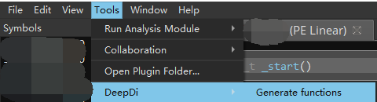

# BinaryNinja Plugin

## Functionality
Generate functions by DeepDi for BinaryNinja.

## Usage

* Edit `KEY` in `/plugins/BinaryNinjaPlugin/src/deepdi_importer.py`
* Copy all stuff under `/plugins/BinaryNinjaPlugin/src/` to the plugins folder of BinaryNinja.
* Open the binary file.
* Click Generate Functions under the tools->DeepDi menu. 

