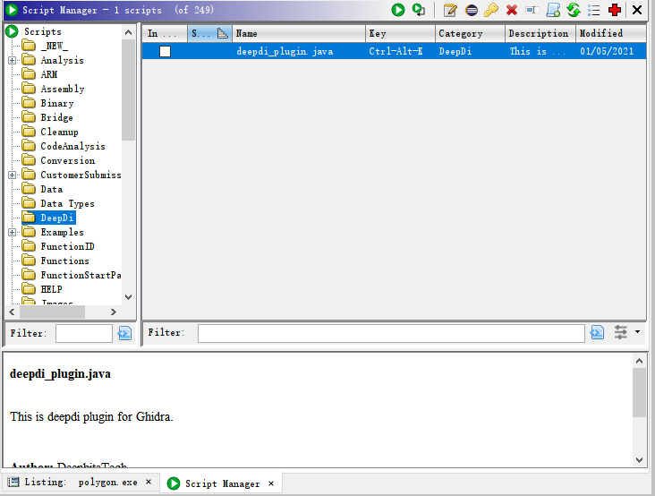

# Ghidra Plugin

## Functionality

Generate functions and instructions by DeepDi.

## Usage

* Edit `String key` in the `./src/deepdi_plugin.java`.
* Copy `/src/deepdi_plugin.java` to ghidra's plugin folder. eg: `~/ghidra_scripts/`.
* Copy `/lib/DeepDi.dll` to somewhere in the PATH.
* Copy `./src/lib/jna.jar` to somewhere ghidra can find. eg: `ghidra_9.1.2_PUBLIC\Ghidra\Features\Base\lib`
* Open Ghidra's script manager and locate to `Deepdi/deepdi_plugin.java`.

    
* Double-click to run.