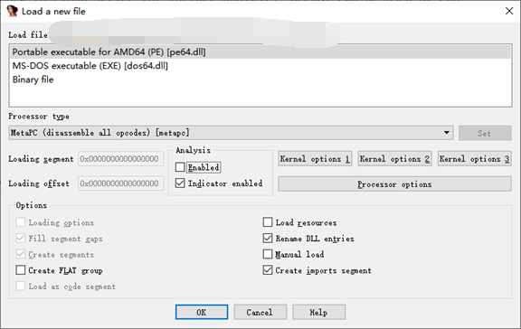
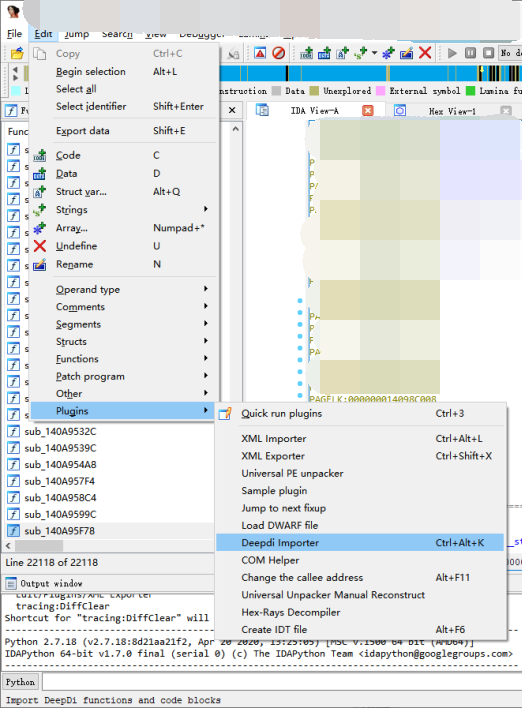
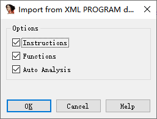

# DeepDiIDAPlugin
The IDA plugin for DeepDi disassembler.

## What it can do
Help generate x86 and x86_64 instructions and functions of a PE file to speed up the disassemble process especially for a large file.

## Work with IDA pro

* Copy `/lib/DeepDi.dll` to `/plugins/IDAPlugin/src/python/deepdi_module/`.
* Edit `KEY` in `/plugins/IDAPlugin/src/plugins/deepdi_importer.py`. Note that it should be encoded as bytes. i.e `b'key'`.
* Put the `/plugins/IDAPlugin/src/plugins/` and `/plugins/IDAPlugin/src/python/` folders under IDA's directory, and combine with the existing folders.
* Open IDA pro and load a new file with Analysis disabled.

* Press `Ctrl-Alt-K` to start the plugin.  

* Choose the options you want.  
